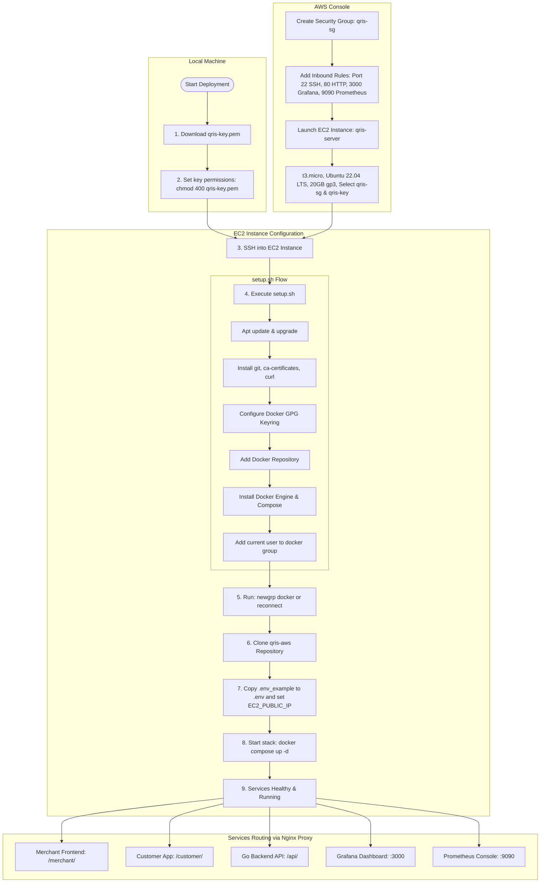

# QRIS — AWS Deployment Guide (AWS Academy Learner Lab)

This guide walks you through deploying the QRIS stack to a single **EC2 t3.micro** on **Ubuntu 22.04 LTS** using only **EC2, VPC, and IAM** from the Learner Lab.

## Deployment Flow Diagram



---

## Step 1 — Set Up Security Group

In the AWS Console → **EC2** → **Security Groups** → **Create security group**:

| Setting | Value |
|---|---|
| Name | `qris-sg` |
| Description | QRIS Security Group |
| VPC | Default VPC (or your VPC) |

**Inbound rules** (Add rule for each):

| Type | Port | Source | Purpose |
|---|---|---|---|
| SSH | 22 | My IP | Your SSH access |
| HTTP | 80 | 0.0.0.0/0 | Nginx Proxy (Dashboard, Customer App, API) |
| Custom TCP | 3000 | 0.0.0.0/0 | Grafana |
| Custom TCP | 9090 | 0.0.0.0/0 | Prometheus (optional) |

> ⚠️ For SSH, restrict to "My IP" — not 0.0.0.0/0.

---

## Step 2 — Launch the EC2 Instance

In the AWS Console → **EC2** → **Launch instances**:

| Setting | Value |
|---|---|
| Name | `qris-server` |
| AMI | **Ubuntu Server 22.04 LTS (HVM), SSD** |
| Architecture | 64-bit (x86) |
| Instance type | **t3.micro** |
| Key pair | Create new → name it `qris-key` → download the `.pem` file |
| Security group | Select `qris-sg` (existing) |
| Storage | 20 GB gp3 (increase from default 8 GB — npm install is large) |

### 💡 Optional (Recommended): Automate Setup via User Data
To automatically install Docker and configure user groups on startup without running the setup script manually later:
1. Expand **Advanced details** at the bottom of the page.
2. Scroll down to the **User data** field.
3. Paste the contents of the [userdata.sh](file:///home/aether/Desktop/Project/qris-aws/aws/userdata.sh) script into the text box.

Click **Launch instance**.

---

## Step 3 — SSH Into the Instance

```bash
# Fix key permissions (required on Linux/Mac)
chmod 400 ~/Downloads/qris-key.pem

# Get your EC2 public IP from the AWS Console → Instances → Public IPv4
ssh -i ~/Downloads/qris-key.pem ubuntu@<EC2_PUBLIC_IP>
```

---

## Step 4 — Run the Setup Script

> 💡 **Note:** If you pasted the [userdata.sh](file:///home/aether/Desktop/Project/qris-aws/aws/userdata.sh) script into **User data** during Step 2, Docker and user configurations are already completed automatically. You can skip this step!

Once connected via SSH:

```bash
# Download and run the setup script
curl -fsSL https://raw.githubusercontent.com/sixarchve/qris-aws/main/aws/setup.sh | bash

# OR if you prefer to clone first:
git clone https://github.com/sixarchve/qris-aws.git
cd qris-aws
bash aws/setup.sh
```

> After the script finishes, run `newgrp docker` (or log out and back in) so Docker works without `sudo`.

---

## Step 5 — Clone the Repo (if not done yet)

```bash
git clone https://github.com/sixarchve/qris-aws.git
cd qris-aws
```

---

## Step 6 — Configure the Environment

```bash
cp .env_example .env
nano .env
```

Changes to make in `.env`:

1. **`EC2_PUBLIC_IP`** — add your EC2 public IP:
   ```
   EC2_PUBLIC_IP=54.123.45.67
   ```

> Save with `Ctrl+O`, exit with `Ctrl+X`.

---

## Step 7 — Start the Stack

```bash
docker compose up -d
```

> On first run, Docker will pull all images. This may take **5–10 minutes** on a fresh instance. The Go backend compiles from source, so it takes a minute to become healthy.

Watch the startup:
```bash
docker compose ps          # check health status
docker compose logs -f golang  # watch the backend start up
```

---

## Step 8 — Access the Services

Once all containers show `healthy` or `running`:

| Service | URL |
|---|---|
| Merchant Frontend | `http://<EC2_PUBLIC_IP>/merchant/` |
| Customer App | `http://<EC2_PUBLIC_IP>/customer/` |
| Go API | `http://<EC2_PUBLIC_IP>/api/health` |
| Grafana | `http://<EC2_PUBLIC_IP>:3000` |
| Prometheus | `http://<EC2_PUBLIC_IP>:9090` |

Grafana login: `admin` / `12345` (from `.env`)

---

## Useful Commands

```bash
# Check all container statuses
docker compose ps

# View backend logs
docker compose logs -f golang

# Stop everything
docker compose down

# Restart after code change (pull + rebuild)
git pull
docker compose up -d --build
```

---

## Troubleshooting

| Problem | Fix |
|---|---|
| `permission denied` on docker | Run `newgrp docker` or re-login |
| Backend crashes on start | Run `docker compose logs golang` — usually a DB connection timing issue, just restart: `docker compose restart golang` |
| Port not accessible | Check Security Group inbound rules in AWS Console |
| Out of memory | Check with `free -h`; stop Prometheus temporarily: `docker compose stop prometheus grafana` |

---

## ⚠️ AWS Academy Lab Notes

- Your **EC2 public IP may change** every time the lab session restarts. If it changes, update `.env` and restart the stack.
- Lab sessions expire — your EC2 instance will stop but data in Docker volumes is preserved if the EBS volume is retained.
- Do NOT commit your `.env` file — it's already in `.gitignore`.
