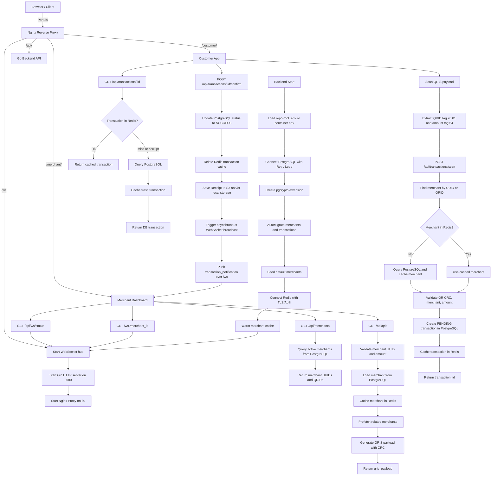

# QRIS Payment System Flow

## Notes

- **PostgreSQL** is the source of truth for all merchants and transactions.
- **Redis** caches active merchants and recent transactions.
- **S3 Receipt Store** saves transaction receipts securely to AWS S3. A local store serves as a backup or when S3 credentials are not supplied.
- **WebSockets** stream successful payment notifications to the merchant dashboard. `/api/ws/status` exposes websocket statistics.
- **Nginx** handles reverse proxying. Its dependency on the backend is set to `service_started`, enabling Nginx to start immediately and expose the port `/api/health` even if the backend is booting or degraded.
